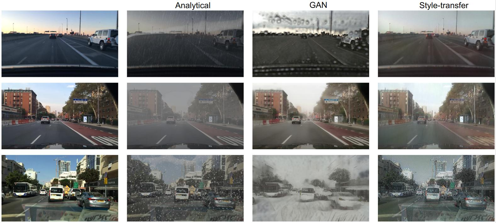
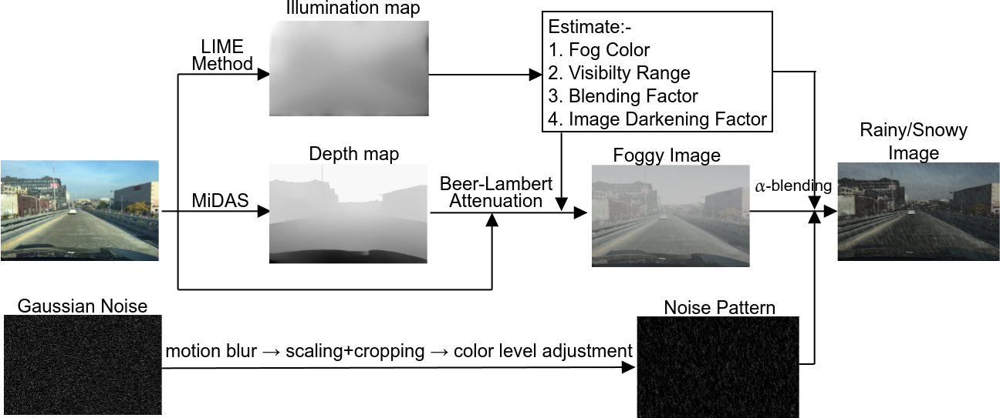

# Weather_Effect_Generator
This repository contains the code used in paper *Robust Object Detection in Challenging Weather Conditions* to generate weather effects synthetically using 

    1. Analytical Methods
    2. Cyclic GAN
    3. Neural Style Transfer
    

### Weather Effect Generation using Analytical Method
We generate the foggy, rainy and snowy weather using the following pipeline. To change the intensity of the weather, parameters like gaussian noise, blurring etc could be changed in the Juyter notebooks *Fog/Rain/Snow_Effect_Generation.ipynb*.

### Weather Effect Generation using Neural Style Transfer
We trained three VGG classifier for fog-clear, rain-clear and snow-clear weather classification. The pretrained weights are available [here](https://drive.google.com/drive/folders/1MEVMLVhrv4t7efwAfCSk13yie8G-XcIB?usp=sharing).

### Weather Effect Generation using Cyclic GAN
We trained three Cyclic-GAN for clear<->fog, clear<->rain and clear<->snow I2I translation. The pretrained weights are available [here](https://drive.google.com/drive/folders/1zfoYWFGku-KJbBwsyl6CFUHL1yiGzAy6?usp=sharing).